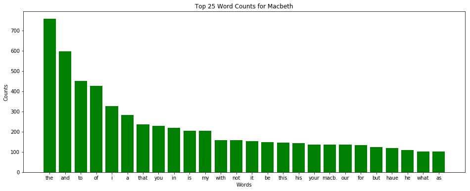

# Project: Analyzing Macbeth

## Introduction
For our first day and first data science project, we're going to do some rudimentry analysis of Shakespeare's classic play: Macbeth! You will get practice working with lists, condtionals and dictionaries, visualizing data, and thinking analytically about data.

## Objectives
You will be able to:
* Show mastery of the content covered in this section

## Getting the Data
Here we start by importing a python package and using it to pull the transcript of Macbeth from the project Gutenberg website. We also preview a few details about what is now stored in the variable macbeth; it's a string with 119,846 characters, the first 500 of which are printed below. 


```python
import requests
macbeth = requests.get('http://www.gutenberg.org/cache/epub/2264/pg2264.txt').text

print(type(macbeth))
print(len(macbeth))
print(macbeth[:500])
```

    <class 'str'>
    120253
    
    
    ***The Project Gutenberg's Etext of Shakespeare's First Folio***
    ********************The Tragedie of Macbeth*********************
    
    
    
    *******************************************************************
    THIS EBOOK WAS ONE OF PROJECT GUTENBERG'S EARLY FILES PRODUCED AT A
    TIME WHEN PROOFING METHODS AND TOOLS WERE NOT WELL DEVELOPED. THERE
    IS AN IMPROVED EDITION OF THIS TITLE WHICH MAY BE VIEWED AS EBOOK
    (#1533) at https://www.gutenberg.org/ebooks/1533
    *********************************


## Your Task

Your task is to create a bar graph of the 25 most common words in Shakespeare's Macbeth.  


A common python programming pattern to counting objects, produce histograms, or update statistics is to make calls to a dictionary as you iterate through a list. For example, given a list of words, you can create a dictionary to store counts and then iterate through the list of words, checking how many times each word has appeared using your dictionary, and updating the dictionary count now that you've seen that word again. The `dictionary.get()` method is very useful in doing this. Read the docstring for the dictionary.get() method and use it along with the pseudocode above to create a bar graph of the 25 most common words from the transcript of Macbeth which has been loaded into a variable 'Macbeth'. Be sure to include a title and appropriate labels for your graph.


```python
import matplotlib.pyplot as plt
%matplotlib inline

# Your code here

# Pseudo-code Outline

# Split the transcript into words

# Convert all text to lowercase
macbeth = macbeth.lower()
# Split transcript into words
macbeth = macbeth.split()
# Strip * from words
macbeth = [string.strip("*") for string in macbeth]

print(f"Total number of words: {len(macbeth)}")

# Create a dictionary
words = {}

# Iterate through the text of Macbeth
# Update word counts
for word in macbeth:
    if word in words.keys():
        words[word] += 1
    else:
        words[word] = 0

# Create Bar Graph
counts = list(words.values())
keys = list(words.keys())

sorted_pairs = list(sorted(zip(counts, keys), reverse=True))
sorted_values, sorted_keys = zip(*sorted_pairs)

plt.figure(figsize=(16,6))
plt.bar(sorted_keys[0:26], sorted_values[0:26], color="green")

# Include descriptive titles and labels
plt.title("Top 25 Word Counts for Macbeth")
plt.ylabel("Counts")
plt.xlabel("Words")
plt.show()


```

    Total number of words: 20389





## Level Up (Optional)
This project should take you about an hour and a half to complete. If you're done much more quickly than that and are not behind in the course, feel free to deepen your knowledge by completing any or all of the following tasks until you run out of time:
* Create a list of top characters by mentions of their names 
* Split the text by which character is talking
* Create subgraphs of the most common words by character
* Reduce the string to the text of the play itself. (Remove any initial notes, forward, introduction, appendix, etc.)
* Come up with some other fun analyses of the text!

## Summary
Congratulations! You've got some extra practice combining various data types into useful programming patterns and done an initial analysis of a classic text!
